# Navigation Hierarchy - Complete Model

## The Full Compound Intelligence Navigation Stack

```mermaid
graph TD
    subgraph "Level 1: Strategic Intent"
        Course[📍 COURSE<br/>Strategic cross-project intent<br/>Example: 'Build auth for /auth + /shared']
    end

    subgraph "Level 2: Conversation Substrate"
        Conv1[💬 Conversation 1<br/>Mission-type conversation]
        Conv2[💬 Conversation 2<br/>Mission-type conversation]
        ConvN[💬 Conversation N<br/>...]
    end

    subgraph "Level 3: Flight Config = STARLOG Session (1:1)"
        FC1[🚀 Flight Config<br/>= STARLOG Session<br/>Tactical workflow pattern]
        FC2[🚀 Flight Config<br/>= STARLOG Session<br/>Tactical workflow pattern]

        subgraph "Waypoint Enforcement (OMNISANC Core)"
            WP1[🗺️ Step 1: check<br/>Only starlog.check allowed]
            WP2[🗺️ Step 2: orient<br/>Only starlog.orient allowed]
            WP3[🗺️ Step 3: start<br/>Only starlog.start_starlog allowed]
            WP4[🗺️ Step 4: work loop<br/>All tools unlocked]

            WP1 --> WP2
            WP2 --> WP3
            WP3 --> WP4
        end

        subgraph "WARPCORE Session Enforcement"
            Start[Phase 1: start_starlog]
            Jump[Phase 2: 🌌 Jumping<br/>Must call fly or update_debug_diary]
            End[Phase 3: end_starlog<br/>Only allowed after Phase 2]

            Start --> Jump
            Jump --> End
        end
    end

    subgraph "Nesting Behavior"
        NestedFC[🔄 Nested Flight Config<br/>Skips duplicate session creation<br/>Already implemented]
    end

    Course --> Conv1
    Course --> Conv2
    Course --> ConvN

    Conv1 --> FC1
    Conv1 --> FC2
    Conv2 --> FC1

    FC1 --> WP1
    FC1 --> Start

    WP4 -.-> NestedFC
    NestedFC -.->|Returns to parent| WP4

    style Course fill:#ff9999
    style Conv1 fill:#99ccff
    style Conv2 fill:#99ccff
    style ConvN fill:#99ccff
    style FC1 fill:#99ff99
    style FC2 fill:#99ff99
    style WP4 fill:#ffff99
    style Jump fill:#cc99ff
    style NestedFC fill:#ffcc99
```



## Key Architectural Constraints

### 1. Flight Config = Session (1:1 Mapping)
- Every flight config execution creates exactly one STARLOG session
- Enforced by OMNISANC Core waypoint progression
- `waypoint.start()` → forces `check → orient → start_starlog` sequence

### 2. WARPCORE Enforcement (Internal to STARLOG)
- Phase 1: `start_starlog()` - Begin session
- Phase 2: 🌌 Jumping - Must do actual work (fly or update_debug_diary)
- Phase 3: `end_starlog()` - Only allowed if Phase 2 happened

### 3. Waypoint Step Enforcement (OMNISANC Core)
- Step 1: Only `starlog.check()` allowed
- Step 2: Only `starlog.orient()` allowed
- Step 3: Only `starlog.start_starlog()` allowed
- Step 4: All tools unlock (work loop begins)

### 4. Nesting Without Duplication
- Flight configs can call other flight configs
- Nested calls skip duplicate session creation
- Maintains clean 1:1 Flight:Session mapping

## Mission = Sequence of Sessions

A **Mission** represents multiple flight configs executing sequentially:
- Mission contains N flight configs
- Each flight config = 1 session
- Missions play out as session sequences across conversation substrate

## Enforcement Layers

```
┌─────────────────────────────────────┐
│     OMNISANC Core                   │
│  (Waypoint Step Enforcement)        │
│  - Forces check → orient → start    │
│  - Gates tool access per step       │
└─────────────────────────────────────┘
            ↓
┌─────────────────────────────────────┐
│     WARPCORE                        │
│  (Session Form Enforcement)         │
│  - Ensures start → work → end       │
│  - Validates Phase 2 jumping        │
└─────────────────────────────────────┘
            ↓
┌─────────────────────────────────────┐
│     OMNISANC Full (Future)          │
│  (Flowchain-based Validation)       │
│  - Custom tool sequences            │
│  - Phase-level enforcement          │
└─────────────────────────────────────┘
```

## The Emergent Properties

1. **Clean Boundaries**: Each level has clear responsibilities
2. **Composability**: Flight configs nest without breaking invariants
3. **Traceability**: Every unit of work maps to a session
4. **Enforceability**: Hooks can validate at each level
5. **Clarity**: Mission = sequence of sessions is explicit

This architecture forces proper boundaries and makes the compound intelligence navigation coherent and self-enforcing.
